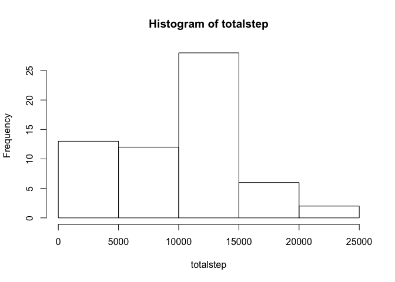
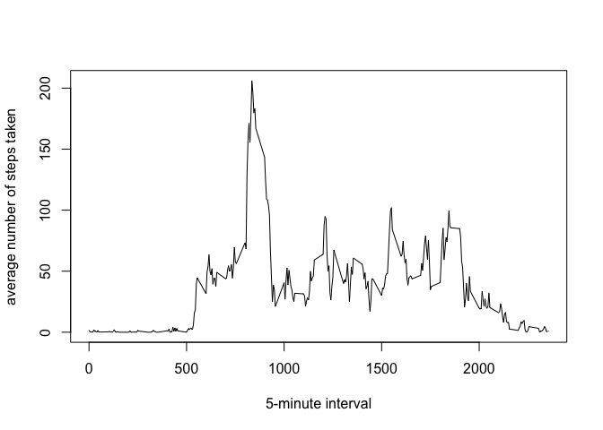
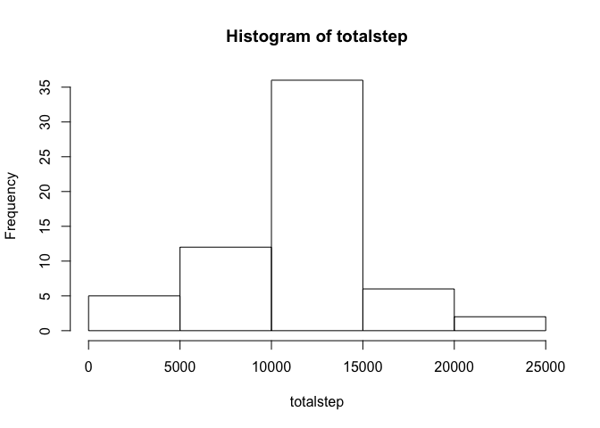
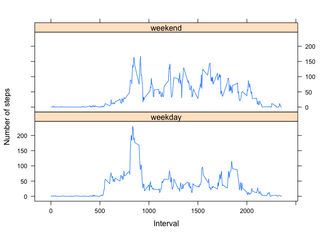

# Reproducible Research: Peer Assessment 1


## Loading and preprocessing the data
We read the data from the file. If the file is not unzipped, we use unzip() funtion to unzip it. The raw data is good enough to anaylze, so no further transformation is taken.

```r
if (!file.exists("activity.csv")) unzip("activity.zip")
rawdata <- read.csv("activity.csv")
```

## What is mean total number of steps taken per day?
We calculate the total number of steps taken per day with tapply() function and make a histogram plot.

```r
totalstep <- tapply(rawdata[,1], rawdata[,2], sum, na.rm = TRUE)
hist(totalstep)
```

<!-- -->

The above plot shows that most days' total number of steps are in the [10000,15000] range. The number of days in [0,5000] range is quite big, and it may be the result of missing values in the raw data.

```r
options(scipen = 20) ## use fixed notation
meanstep <- round(mean(totalstep), digits = 2)
medianstep <- round(median(totalstep), digits = 2)
```
The mean of total number of steps taken per day: 9354.23

The median of total number of steps taken per day: 10395

## What is the average daily activity pattern?
We compute the average number of steps taken in the 5-minute intervals averaged across all days, and make a time series plot.

```r
averagestep <- tapply(rawdata[,1], rawdata[,3], mean, na.rm=TRUE)
plot(names(averagestep), averagestep, type="l", xlab = "5-minute interval", ylab = "average number of steps taken")
```

<!-- -->

```r
maxinterval <- names(which.max(averagestep))
maxstep <- max(averagestep)
```

In the plot, we can find that the 5-minute interval 835 contains the maximum number of average steps across all the days.

The average step in that 5-minute interval is 206.1698113 steps.


## Imputing missing values
Note that there are a number of days/intervals where there are missing values (coded as 𝙽𝙰). The presence of missing days may introduce bias into some calculations or summaries of the data.

```r
numofNA <- sum(is.na(rawdata[,1]))
```
The total number of missing values in the dataset is 2304. It can explain why the number of days in [0,5000] range is so big in the histogram plot.

We use the mean for that 5-minute interval to filling in all of the missing values in the dataset. 

```r
newdata <- rawdata
newdata[is.na(newdata[,1]), 1] <- averagestep[dimnames = as.character(newdata[is.na(newdata[,1]), 3])]
```
With the new data set, we make a histogram of the total number of steps taken each day again.

```r
totalstep <- tapply(newdata[,1], newdata[,2], sum, na.rm = TRUE)
hist(totalstep)
```

<!-- -->

The new histogram plot is different from the old plot. The number of daysin the [0,5000] range is smaller and the number in the [10000,15000] range is bigger.


```r
meanstep <- round(mean(totalstep), digits = 2)
medianstep <- round(median(totalstep), digits =2)
```

The mean of total number of steps taken per day: 10766.19

The median of total number of steps taken per day: 10766.19

## Are there differences in activity patterns between weekdays and weekends?
To make a anaylsis of the differences in activity patterns between weekdays and weekends, we create a new factor variable in the dataset with two levels – “weekday” and “weekend” indicating whether a given date is a weekday or weekend day at first.

We use the .indexwday() funtion of the xts package to check whether a given date is weekday or weekend.

```r
library(xts)
```

```
## Loading required package: zoo
```

```
## 
## Attaching package: 'zoo'
```

```
## The following objects are masked from 'package:base':
## 
##     as.Date, as.Date.numeric
```

```r
isweekday <- as.numeric(.indexwday(as.xts(as.Date(newdata[,2]))) %in% 1:5)
newdata$daytype <- factor(isweekday, levels = c(1,0), labels = c("weekday","weekend"))
```

We make a panel plot containing a time series plot of the 5-minute interval (x-axis) and the average number of steps taken, averaged across all weekday days or weekend days (y-axis). The lattice ploting system is used.

We use tidyr packages to transform the data into a format suitable for ploting.


```r
## check if the required packages is installed?
if (!"tidyr" %in% installed.packages()) 
  install.packages("tidyr")
if (!"lattice" %in% installed.packages()) 
  install.packages("lattice")

## load packages
library(tidyr)
library(lattice)

## compute the mean steps in weekdays and weekends respectively
averagestep2 <- as.data.frame(tapply(newdata[,1], newdata[,3:4], mean))

## make some transformation to the data to prepare for the ploting
averagestep2$interval <- rownames(averagestep2)
steps_data <- gather(averagestep2, daytype, steps, -interval)
steps_data <- transform(steps_data, daytype = factor(daytype))
steps_data <- transform(steps_data, interval = as.numeric(interval))

## ploting with the lattice plot system
xyplot(steps ~ interval | daytype, steps_data, layout = c(1,2), type = "l", xlab = "Interval", ylab = "Number of steps")
```

<!-- -->

With the above plot, we can find that people maybe wake up more early in the weekdays because they have to go to work. So the number of steps rises from 5:00 am in the day, but in the same intervals in the weekends, the number of steps is lower.
